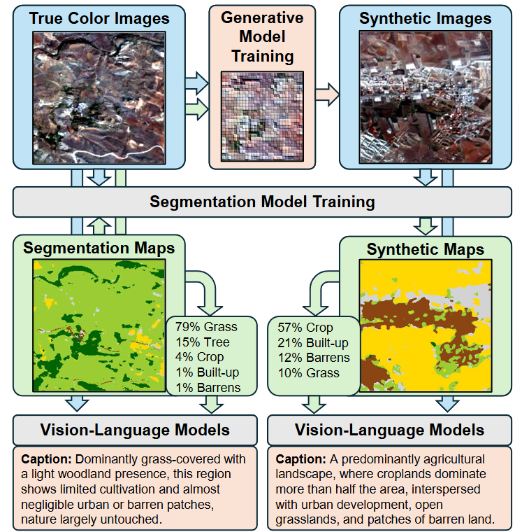
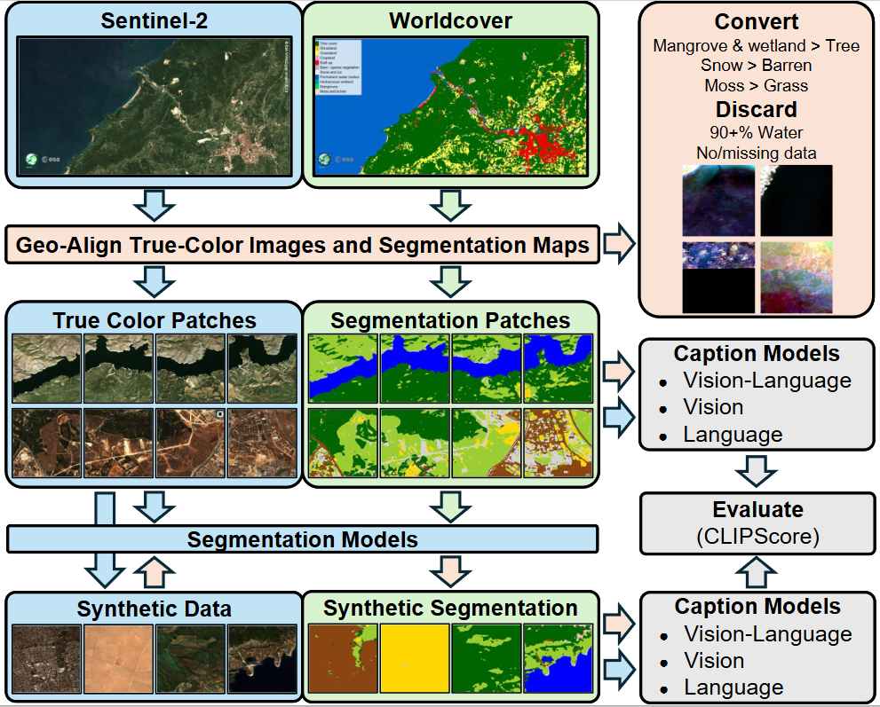

# Grounding Synthetic Data Generation With Vision and Language Models
**ECCV 2026** | [Ümit Mert Çağlar](mailto:mecaglar@metu.edu.tr), [Alptekin Temizel](mailto:atemizel@metu.edu.tr) | METU, Turkey

[](https://arxiv.org/abs/2603.09625)
[](https://zenodo.org/records/18890661)
[](https://creativecommons.org/licenses/by/4.0/)
[](https://www.python.org/downloads/)

> **TL;DR:** We introduce **ARAS400k**, a large-scale remote sensing dataset containing 100k real and 300k synthetic images paired with semantic segmentation maps and over 2 million descriptive captions. Our vision-language grounded framework proves that combining real data with synthetic data consistently outperforms real-data baselines in semantic segmentation, effectively solving class-imbalance for under-represented categories.



---

## ✨ Key Contributions

* **Large-Scale Multi-Modal Dataset:** 400,240 total images (100k real, 300k synthetic) paired with high-quality segmentation maps and descriptive captions.
* **Context-Aware Captioning Framework:** An automated pipeline utilizing composition statistics and vision-language foundation models (Gemma3, Qwen3-VL) to generate highly descriptive, non-redundant captions.
* **Proven Downstream Utility:** Extensive benchmarking demonstrates that models trained on augmented data (real + synthetic) consistently outperform those trained on real data alone.
* **Vision-Language Integration:** A novel integration of foundation models to evaluate synthetic data through semantic consistency and redundancy reduction.

---

## 📊 The ARAS400k Dataset

Traditional remote sensing datasets are limited in scale and suffer from high caption redundancy (often >70%). ARAS400k scales the volume while dramatically reducing repetition through our hybrid captioning approach.

| Dataset | Volume (Images) | Total Captions | Caption Redundancy | CLIPScore |
|---|---|---|---|---|
| **NWPU** | 31,500 | 157,500 | 72.65% | 30.25 |
| **RSICD** | 10,921 | 54,605 | 67.02% | 29.11 |
| **UCMC** | 2,100 | 10,500 | 80.88% | 30.18 |
| **ARAS400k (Ours)** | **400,240** | **2,001,200** | **12.85%** | **29.66** |

**Dataset Download:** Available on [Zenodo](https://zenodo.org/records/18890661). 

**Verification Hashes (MD5):**
| Filename | MD5 Checksum |
|---|---|
| `train.zip` | `95cd5caea68c813fd86888f9cd95b627` |
| `val.zip` | `76e61fd7557d65ba0596e44c0f92b43f` |
| `test.zip` | `01679231ee8e38701f5d3ab7de0b5719` |
| `synth.zip` | `0dc95bfdda44a816ade0d7ea747e4f9c` |

---

## 📈 Experimental Highlights

We tested multiple segmentation architectures (U-Net, U-Net++, PAN, DeepLabV3+, SegFormer, FPN). 

**Key Takeaways:**
1. **Synthetic Data is a Viable Alternative:** Models trained exclusively on our 300k synthetic dataset reach highly competitive performance levels, trailing the real-data baseline by only ~2.0 F1 score.
2. **Augmentation Wins:** Injecting synthetic samples into the real dataset improves overall segmentation performance across the board (e.g., Segformer F1 jumps from 77.09 to 77.80).
3. **Solving Class Imbalance:** The most significant performance gains occurred in historically under-represented classes (e.g., Shrub and Barren land covers) when utilizing synthetic data augmentation.

---

## 🛠️ Pipeline & Reproducibility 

Our fully open-sourced pipeline spans data acquisition, generation, captioning, and segmentation. 



### Docker Environments
For stable reproducibility, pull our curated environments:
* **Segmentation:** `docker pull mertcaglar/segm`
* **Generative Models:** `docker pull mertcaglar/stylegan3`
* **Transformers:** `docker pull huggingface/transformers-pytorch-gpu`

### 1. Data Acquisition & Processing
* `dataset_downloader.py`: Automates retrieval of Sentinel-2 RGBNIR and ESA WorldCover 2021 maps.
* `dataset_creator.py`: Slices imagery into 256x256 patches, maps specific classes, and filters corrupted/empty data.

### 2. Synthetic Data Generation
We utilize an optimized StyleGAN3 and a U-Net SPADE GAN architecture. To initiate unconditional generation (optimized for 24GB VRAM):
```bash
python stylegan3/train.py \
  --outdir="out/ARAS400k" \
  --cfg=stylegan2 \
  --data="ARAS400k/train/images" \
  --gpus=1 --batch=256 --gamma=0.01 --mirror=1 --aug="ada" \
  --kimg 5000 --snap 200 --cbase 16384 --workers 16

```

### 3. Multimodal Image Captioning

We support multiple modalities for rich metadata creation:

* `vision_language_captioner.py`: Hybrid approach using Qwen3-VL-8B-Instruct (highest variety, lowest redundancy).
* `vision_captioner.py`: Vision-only utilizing Gemma-3-4B-IT.
* `text_captioner.py`: Text-only based strictly on numerical land-cover percentages.
* Localized options like Ollama (`ollama_captioner.py`) and OpenAI batching (`gpt_captioner.py`) are also included.

### 4. Semantic Segmentation & Feature Evaluation

* `segmentation_train.py`: Trains models (e.g., Segformer with EfficientNet-B7) tracking loss, macro F1, precision, and IoU via W&B.
* `segformer_vis.py`: Extracts bottleneck features to generate t-SNE and UMAP projections, validating the distributional alignment of our synthetic and real data.

---

## 📜 Citation

If you find this dataset or codebase useful in your research, please consider citing:

```bibtex
@article{ccauglar2026grounding,
  title={Grounding Synthetic Data Generation With Vision and Language Models},
  author={{\c{C}}a{\u{g}}lar, {\"U}mit Mert and Temizel, Alptekin},
  journal={arXiv preprint arXiv:2603.09625},
  year={2026}
}

```
