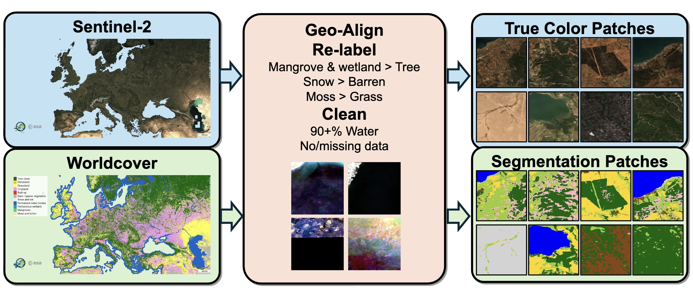
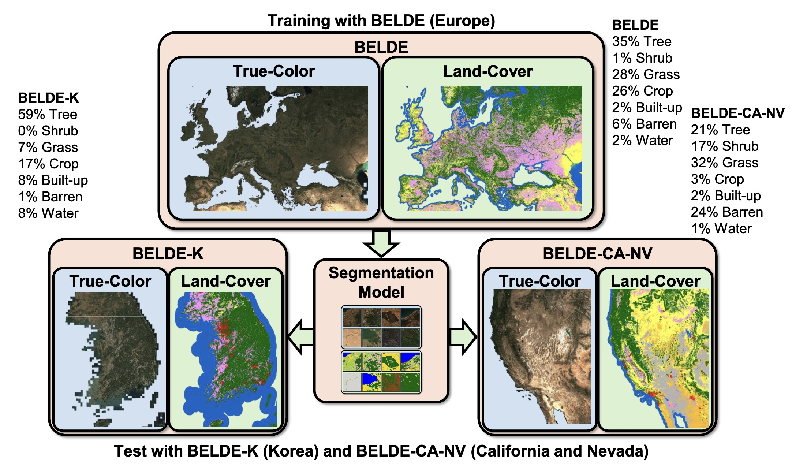

# BELDE: Building a Large-scale Earth-observation Land-cover Dataset for Europe

**Authors:** Ümit Mert Çağlar and Alptekin Temizel

Graduate School of Informatics, Middle East Technical University, Ankara, Turkey

---

## Abstract

Earth observation imagery is fundamental for environmental monitoring, urban planning, disaster assessment, and climate analysis. While multi-spectral sensors are highly capable, true-color (RGB) imagery remains heavily utilized due to power, cost, and deployment constraints across many operational platforms. To address the limitations of existing datasets regarding geographic coverage and scale, this work introduces BELDE, a publicly available benchmark tailored for RGB-based remote sensing semantic segmentation. Constructed from Sentinel-2 images and ESA WorldCover maps, the dataset provides 1,088,385 curated image-mask pairs at a 10 m spatial resolution covering a diverse European footprint.

## Dataset Pipeline

The dataset is constructed via a fully automated pipeline that aligns true-color images with corresponding land-cover maps. Through rigorous, rule-based data curation and strict filtering criteria, over 1.94 million non-informative, corrupted, or single-class dominated patches were pruned. This ensures an information-dense training set optimized for efficient model distillation.

## Key Contributions

* The introduction of BELDE, comprising 1,088,385 geo-aligned image-mask pairs across Europe, established via an automated quality filtering pipeline.

* The demonstration of model distillation utility with lightweight architectures, showing that compact networks (e.g., LALE-S2 with 2.61M parameters) achieve competitive segmentation accuracy for resource-constrained edge deployments.

* The release of out-of-domain evaluation datasets, BELDE-K (16,607 pairs in the Republic of Korea) and BELDE-CA-NV (88,155 pairs in California-Nevada, USA), to quantify geographic domain shift.

* A comprehensive benchmark evaluation of 17 semantic segmentation architectures spanning CNN, dense prediction transformer, and lightweight hybrid families.

## Cross-Region Generalization

To facilitate systematic evaluation of domain shift, models trained on the primary European BELDE dataset were tested on geographically distinct benchmarks without overlap. Performance evaluations on BELDE-K and BELDE-CA-NV indicate a consistent degradation under geographic domain shift across all architectural families. This highlights that RGB-only segmentation models rely heavily on region-specific spatial and textural cues, emphasizing the necessity of geographically diverse benchmarks for robust Earth observation systems.

---

## Dataset Availability and Reproducibility

The datasets and software framework created and used throughout this work are publicly available under the Creative Commons Attribution 4.0 International (CC BY 4.0) license ([https://creativecommons.org/licenses/by/4.0/](https://creativecommons.org/licenses/by/4.0/)).

**BELDE is available at:**
[datasets/caglarmert/BELDE](https://huggingface.co/datasets/caglarmert/BELDE)

**BELDE-K is available at:**
[datasets/caglarmert/BELDE-K](https://huggingface.co/datasets/caglarmert/BELDE-K)

**BELDE-CA-NV is available at:**
[datasets/caglarmert/BELDE-CA-NV](https://huggingface.co/datasets/caglarmert/BELDE-CA-NV)

**Codes for data and experiments is available at:**
[github.com/caglarmert/BELDE](https://github.com/caglarmert/BELDE)
