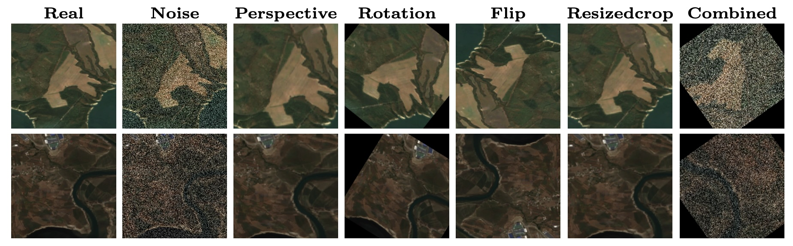
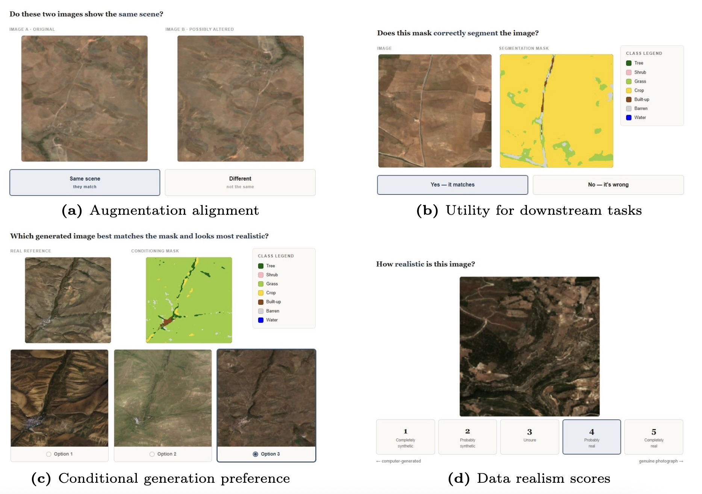
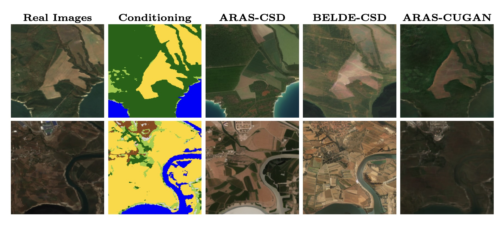

  <h1>Benchmarking the Alignment of Data-Quality Metrics, Human Judgment and Land-Cover Segmentation Performance for Earth Observation</h1>
  
  

    <strong>Ümit Mert Çağlar</strong> &nbsp;&nbsp;&nbsp;&nbsp; <strong>Alptekin Temizel</strong>
  

  

    <em>Graduate School of Informatics, Middle East Technical University, Ankara, Turkey</em>
  

  
   

  <!-- Quick Links -->
  

    <a href="https://huggingface.co/datasets/caglarmert/BELDE"><strong>[ BELDE ]</strong></a> &nbsp;&nbsp;
    <a href="https://huggingface.co/datasets/caglarmert/BELDE-K"><strong>[ BELDE-K ]</strong></a> &nbsp;&nbsp;
    <a href="https://huggingface.co/datasets/caglarmert/BELDE-CA-NV"><strong>[ BELDE-CA-NV ]</strong></a> &nbsp;&nbsp;
    <a href="https://zenodo.org/records/18890661"><strong>[ ARAS400k ]</strong></a>
  

## Abstract

Volume and quality of datasets are crucial for deep learning model training, yet they are often constrained by availability and data acquisition costs. Synthetic data augmentation can extend existing datasets with realistic images, but automated quality assessment metrics (e.g., FID, KID, IS, LPIPS, SSIM) frequently focus on visual fidelity without reflecting downstream utility. This work systematically evaluates Earth observation datasets alongside synthetic counterparts generated by deep generative models. We compare automatic metrics against human perception and downstream semantic segmentation tasks. Our findings reveal a stark misalignment: semantics-preserving perturbations drastically alter metric scores while leaving human recognition unaffected. Furthermore, synthetic samples that score poorly on automatic metrics can achieve comparable perceived realism and actively improve downstream performance when combined with real data. These results demonstrate that automatic evaluation of synthetic Earth observation datasets cannot rely solely on standard latent metrics, requiring joint consideration of downstream task utility alongside perceptual diagnostics.

## Key Contributions
* **Pitfalls of Automated Data Pruning:** Demonstration that standard latent-space metrics exhibit high volatility under spatial augmentations, proving them unreliable for automated data pruning or synthetic quality assessment.
* **Human Perception Study:** A comprehensive four-stage study with 88 participants quantifying recognition accuracy, visual preference, and cognitive load to provide a human baseline for generative data quality.
* **Three-Way Alignment Analysis:** Identification of major disconnections among automated quality metrics, human visual preference, and downstream model performance, highlighting the misalignment between fidelity, preference, and utility.
* **Downstream Utility Benchmark:** Empirical evidence showing that synthetic datasets with poor fidelity scores act as highly effective additions when blended with real data, yielding performance gains that standard quality metrics fail to predict.

<figure align="center">
  
  <figcaption><b>Figure 1:</b> Visual comparison of image transformations across real images.</figcaption>
</figure>

## Human Perception and Evaluation Pipeline
<figure align="center">
  
  <figcaption><b>Figure 2:</b> Human perception study screens for (a) data augmentation alignment, (b) utility for downstream tasks, (c) conditional generation preference and (d) data realism scores</figcaption>
</figure>

To evaluate the alignment between automated quality metrics, human perception, and downstream data utility, the evaluation framework is structured into four sequential phases:

<ol>
  <li><b>Augmentation Alignment:</b> Evaluating human robustness to geometric and spectral perturbations to establish a baseline against automated metric volatility.</li>
  <li><b>Utility for Downstream Tasks:</b> Measuring semantic alignment by judging Earth observation images against their associated land-cover segmentation maps to test interpretability.</li>
  <li><b>Conditional Generation Preference:</b> Isolating architectures that produce the most contextually plausible and consistent imagery according to human evaluators.</li>
  <li><b>Data Realism Scores:</b> Collecting explicit realism ratings to correlate quantitative statistical metrics directly with qualitative human assessment.</li>
</ol>

## Guidelines for Data-Centric Synthetic Curation

Based on empirical findings exposing the paradox between isolated fidelity metrics and actual utility, we propose the following practical guidelines for dataset curation and sample pruning:

<ul>
    <li><b>Avoid metric-only dataset pruning:</b> Isolated quality metrics heavily penalize spatial features that deep segmentation models utilize.</li>
    <li><b>Account for orientation bias in filtering:</b> Feature extractors used in data quality metrics are orientation-sensitive, leading to false pruning triggers under standard geometric augmentations.</li>
    <li><b>Prioritize task-aware utility over fidelity:</b> Curation pipelines must complement generic quality metrics with direct downstream task evaluation.</li>
</ul>

## Dataset Availability and Reproducibility
<figure align="center">
  
  <figcaption><b>Figure 3:</b> Image generation comparison of conditional Stable Diffusion for BELDE-trained (BELDE-CSD), ARAS-trained (ARAS-CSD) and conditional U-Net GAN (ARAS-CUGAN) with the real and conditioning images (segmentation)</figcaption>
</figure>

The datasets used throughout this work are publicly available under the Creative Commons Attribution 4.0 International license (<a href="https://creativecommons.org/licenses/by/4.0/">CC BY 4.0</a>).

| Resource | Link |
| :--- | :--- |
| **BELDE** | [datasets/caglarmert/BELDE](https://huggingface.co/datasets/caglarmert/BELDE) |
| **BELDE-K** | [datasets/caglarmert/BELDE-K](https://huggingface.co/datasets/caglarmert/BELDE-K) |
| **BELDE-CA-NV** | [datasets/caglarmert/BELDE-CA-NV](https://huggingface.co/datasets/caglarmert/BELDE-CA-NV) |
| **ARAS400k** | [zenodo/records/18890661](https://zenodo.org/records/18890661) |
| **ARAS-CSD** | [datasets/caglarmert/ARAS-CSD-2](https://huggingface.co/datasets/caglarmert/ARAS-CSD-2) |
| **BELDE-CSD** | [datasets/caglarmert/ARAS-CSD-1E7](https://huggingface.co/datasets/caglarmert/ARAS-CSD-1E7) |
| **ARAS-CUGAN** | [datasets/caglarmert/ARAS-C-UNetGAN](https://huggingface.co/datasets/caglarmert/ARAS-C-UNetGAN) |
