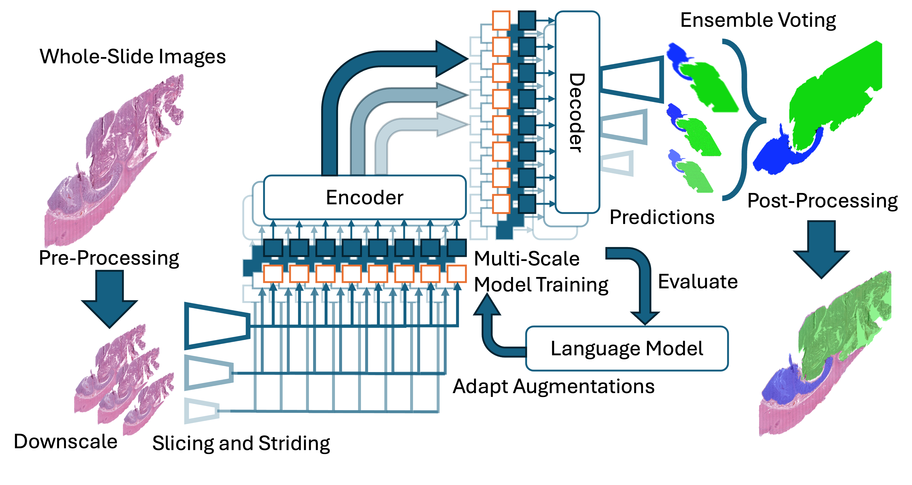
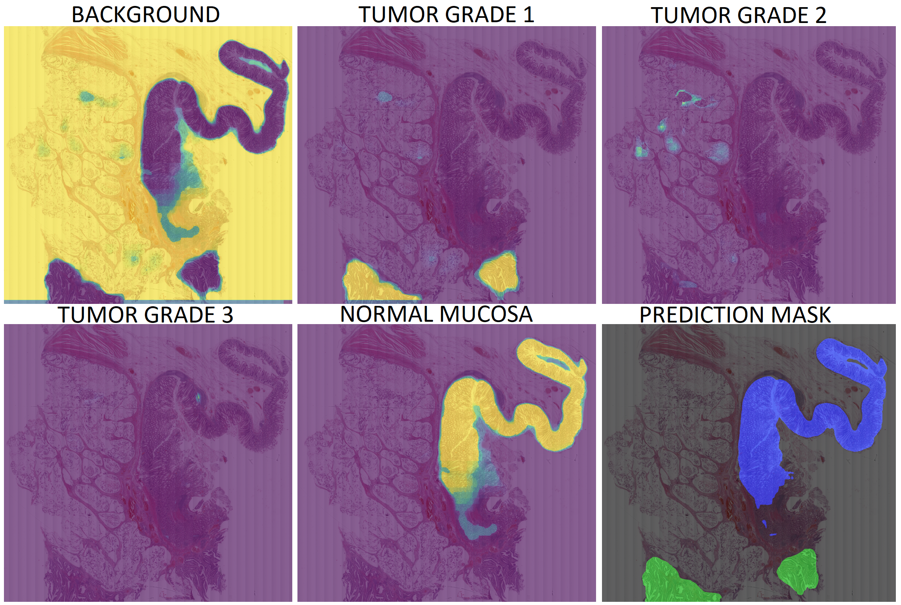

# Colorectal Cancer Segmentation with Adaptive Augmentation and Multi-Resolution Ensemble Models
**ICMV 2025** | [Ümit Mert Çağlar](https://scholar.google.com/citations?user=1bUVmLsAAAAJ&hl=en)<a class="orcid-link" href="https://orcid.org/0000-0002-0391-3847" target="_blank" rel="noopener" title="ORCID: 0000-0002-0391-3847"></a>, [Alptekin Temizel](https://scholar.google.com/citations?user=3grTeasAAAAJ&hl=en)<a class="orcid-link" href="https://orcid.org/0000-0001-6082-2573" target="_blank" rel="noopener" title="ORCID: 0000-0001-6082-2573"></a> | METU, Turkey

[](https://www.spiedigitallibrary.org/conference-proceedings-of-spie/14114/141140I/Colorectal-cancer-segmentation-with-adaptive-augmentation-and-multiresolution-ensemble-models/10.1117/12.3096537.short)
[](https://github.com/caglarmert/ICIP2025)
[](https://www.python.org/downloads/)

> **TL;DR:** We present an automated whole-slide segmentation pipeline for colorectal cancer tumor grading (grades 1-3 and normal mucosa), combining dense prediction transformers, LLM-guided adaptive augmentation, multi-resolution soft-voting ensembles, and mask post-processing. On the CCTGS dataset, this raises the F1 score from a 62.92 baseline (Swin Transformer) to 69.84.



---

## Key Contributions

* **Comprehensive Architecture Search:** Extensive experiments across Fully Connected Networks, U-Net, SegFormer, and Dense Prediction Transformers (DPT) with MaxViT, EfficientNet, and ResNet encoder backbones to identify optimal models for CRC tumor grade segmentation.
* **LLM-Guided Adaptive Augmentation:** An augmentation policy optimization loop where a large language model adjusts the augmentation strategy based on current evaluation metrics and training configuration.
* **Multi-Resolution Ensembling:** A soft-voting ensemble across models trained at three downscaling levels (20x, 40x, 60x) with a class-specific bias vector favoring tumor classes, outperforming both single-scale models and hard-voting.
* **Post-Processing Pipeline:** Gaussian blurring, morphological closing, and connected-components filtering to refine segmentation masks with no additional training cost.

---

## Method

Whole-slide images are divided into non-overlapping 2048×2048 patches and downscaled in parallel at three levels (20x, 40x, 60x) to balance detail against compute cost. Multiple encoder-decoder architectures are trained per resolution level using an LLM-guided adaptive augmentation policy, which reads current metrics and training configuration to update the augmentation strategy each cycle. The top-performing models are combined via soft-voting ensembling: per-pixel class probabilities are aggregated across the top-N predictions from the best M models with a class-specific bias favoring tumor classes, and the final mask is produced by taking the argmax. A three-stage post-processing pipeline (Gaussian smoothing, morphological closing, connected-components filtering) then refines the mask boundaries.

---

## Results on CCTGS

On the Colorectal Cancer Tumor Grade Segmentation (CCTGS) dataset (103 whole-slide images, tumor grades 1-3 plus normal mucosa), our best single-scale model already surpasses the strongest literature baseline, and ensembling plus post-processing add further gains.

| Model | F1 | Precision | Recall |
|---|---|---|---|
| Swin (baseline) | 62.92 | 60.94 | 69.63 |
| DPT (ours, single-scale) | 67.39 | 63.44 | 72.31 |
| Hard-voting ensemble | 69.07 | 65.41 | 73.89 |
| Soft-voting ensemble | 69.73 | 68.63 | 71.14 |
| **+ Post-processing** | **69.84** | 68.62 | 71.66 |

**Key Takeaways:**
1. **Transformers Win:** DPT and SegFormer architectures with pre-trained transformer encoders (MaxViT) substantially outperform CNN-based U-Net and FCN baselines.
2. **Adaptive Augmentation Helps:** LLM-guided adaptive augmentation improves F1 over static augmentation in every comparison, e.g. 63.08 → 67.39 F1 for the best DPT configuration.
3. **Ensembling Compounds Gains:** Soft-voting across multi-resolution models, followed by lightweight post-processing, adds +2.45 F1 over the best single-scale model at no extra training cost.

<figure align="center">
  
  <figcaption><b>Figure:</b> Class-activation heatmaps for background, tumor grades 1-3, and normal mucosa, alongside the final segmentation mask on a sample histopathology image.</figcaption>
</figure>

## Generalization to EBHI-SEG

To test generalization beyond CCTGS, we evaluated on the EBHI-SEG dataset (4,456 images, six colorectal tumor types). Our approach consistently and substantially outperforms U-Net, Seg-Net, and MedT baselines across nearly all classes and metrics, with the adaptively-augmented model achieving the highest weighted-average F1 (93.9 vs. 90.0 for the strongest baseline), confirming the method transfers beyond the primary benchmark.

---

## Ablation Study

We trained 245 models over 1,500+ GPU-hours, sweeping six loss functions, three optimizers, four architectures with ten encoder backbones, and three input resolutions:

* **Loss functions:** Dice, Tversky, and Jaccard consistently outperform cross-entropy and Focal loss, which suffer under the heavy background-class imbalance; Dice performed best overall since it directly optimizes F1.
* **Architecture:** DPT with a MaxViT encoder was the strongest configuration, followed closely by SegFormer; both clearly outperform CNN-based U-Net and FCN.
* **Resolution:** All three downscaling levels (20x, 40x, 60x) achieve comparable performance, making careful architecture and hyperparameter selection more important than resolution alone.
* **Augmentation & ensembling:** Adaptive augmentation improves every architecture over static augmentation, and combining multi-resolution models via soft-voting plus post-processing yields the best overall result.

---

## Reproducibility

| Resource | Link |
| :--- | :--- |
| **Source Code** | [github.com/caglarmert/ICIP2025](https://github.com/caglarmert/ICIP2025) |
| **Paper** | [SPIE Digital Library](https://www.spiedigitallibrary.org/conference-proceedings-of-spie/14114/141140I/Colorectal-cancer-segmentation-with-adaptive-augmentation-and-multiresolution-ensemble-models/10.1117/12.3096537.short) |

This work was supported by the Middle East Technical University Scientific Research Projects Coordination Unit (Grant ADEP-704-2024-11486) and the TÜBİTAK 2224-A Grant Program. Experiments were performed at TÜBİTAK ULAKBIM (TRUBA) and the AI and Big Data Analytics Laboratory at METU-DTX.

---

## Citation

If you find this work useful in your research, please consider citing:

```bibtex
@inproceedings{caglar2025colorectal,
  title={Colorectal Cancer Segmentation with Adaptive Augmentation and Multi-Resolution Ensemble Models},
  author={Caglar, Umit Mert and Temizel, Alptekin},
  booktitle={Eighteenth International Conference on Machine Vision (ICMV 2025)},
  year={2025},
  organization={SPIE}
}
```
