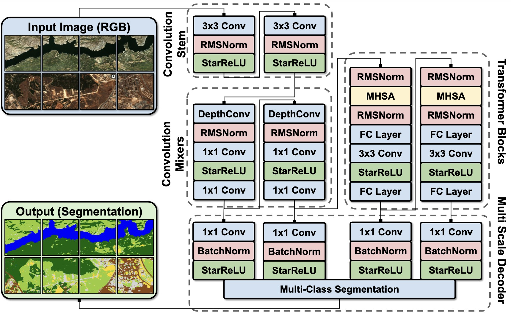

# LALE: Lightweight-Transformer Architecture for Land-Cover Estimation
**ICMV 2026** | [Ümit Mert Çağlar](https://scholar.google.com/citations?user=1bUVmLsAAAAJ&hl=en)<a class="orcid-link" href="https://orcid.org/0000-0002-0391-3847" target="_blank" rel="noopener" title="ORCID: 0000-0002-0391-3847"></a>, [Alptekin Temizel](https://scholar.google.com/citations?user=3grTeasAAAAJ&hl=en)<a class="orcid-link" href="https://orcid.org/0000-0001-6082-2573" target="_blank" rel="noopener" title="ORCID: 0000-0001-6082-2573"></a> | METU, Turkey

[](https://arxiv.org/abs/2606.02092)
[](https://github.com/caglarmert/LALE)
[](https://creativecommons.org/licenses/by/4.0/)
[](https://www.python.org/downloads/)

> **TL;DR:** We introduce **LALE**, a hybrid convolution-transformer segmentation architecture that bifurcates its encoder by resolution, lightweight ConvMixer stages handle high-resolution local features, while transformer stages confine the quadratic cost of self-attention to deep, downsampled feature maps. Combined with an all-MLP multi-scale decoder and efficient RMSNorm/StarReLU operations, our smallest variant (1.6M parameters) reaches within 2.6 F1 points of the best baseline (UPerNet) on ARAS400k while using 4.5× fewer parameters, 7× less storage and 17× fewer GMACs.



---

## Key Contributions

* **Resolution-Bifurcated Hybrid Encoder:** A lightweight attention-convolution hybrid hierarchical architecture where ConvMixer blocks handle high-resolution local feature extraction (stages 1–2) and transformer blocks handle low-resolution global context (stages 3–4), confining self-attention's O(N²) cost to the smallest feature maps.
* **Lightweight Multi-Scale Decoder:** An all-MLP decoder that fuses multi-scale features via pointwise convolutions and bilinear upsampling, avoiding parameter-heavy upsampling heads.
* **Efficient Operation-Level Choices:** RMSNorm in place of LayerNorm, StarReLU in place of GELU, and 3×3 stride-2 convolutions in place of 7×7 kernels, together reducing compute and memory footprint without sacrificing accuracy.
* **Comprehensive Benchmark:** An extended reference benchmark on ARAS400k spanning CNN, transformer, and hybrid architectures, plus a generalization study on the LiTS liver/tumor segmentation benchmark, establishing LALE on a favorable accuracy-efficiency Pareto frontier.

---

## Architecture

LALE bifurcates its four-stage encoder by resolution: a convolutional stem (two 3×3 stride-2 convolutions with RMSNorm and StarReLU) reduces the input by a factor of four, followed by two ConvMixer stages for local feature extraction and two transformer stages (Multi-Head Self-Attention + ConvMLP) for global context modeling at the deepest, lowest-resolution feature maps. A lightweight multi-scale decoder projects each stage's features to a unified 128-channel dimension, upsamples and concatenates them, and predicts per-pixel class logits through a final 1×1 convolution.

---

## Results on ARAS400k

We benchmark LALE against CNN baselines (EfficientNet-backboned DeepLabV3, DeepLabV3+, FPN, LinkNet, PAN, UNet, UNet++, UPerNet, SegFormer) and dense-prediction transformers (EfficientFormer, DeiT3, MaxViT, FastViT) on the [ARAS400k](ARAS400k.html) segmentation benchmark.

| Architecture | F1 | IoU | Params (M) | GMACs | Throughput (samples/sec) |
|---|---|---|---|---|---|
| UPerNet | **77.31** | **65.42** | 11.6 | 13.62 | 89,889 |
| Unet | 77.23 | 65.28 | 6.3 | 3.05 | 80,002 |
| UnetPlusPlus | 76.86 | 64.90 | 6.6 | 5.62 | 85,047 |
| FPN | 76.38 | 64.35 | 5.8 | 2.51 | 97,817 |
| Segformer | 76.47 | 64.44 | 4.5 | 2.05 | 85,491 |
| DeepLabV3+ | 76.37 | 64.30 | 4.9 | 1.46 | 90,321 |
| PAN | 76.12 | 63.93 | 4.1 | 0.98 | 83,675 |
| DeepLabV3 | 75.23 | 63.01 | 7.3 | 6.44 | 105,217 |
| Linknet | 75.45 | 63.21 | 4.2 | 0.58 | 97,157 |
| DeiT3-Base | 76.10 | 63.97 | 117.1 | 39.89 | 6,156 |
| MaxViT-Tiny | 75.82 | 63.64 | 60.8 | 33.13 | 1,589 |
| EffFormer-L7 | 75.35 | 63.13 | 100.3 | 32.16 | 2,691 |
| EffFormer-L3 | 75.23 | 62.97 | 49.1 | 25.85 | 2,060 |
| FastViT-MCI0 | 75.53 | 63.33 | 29.1 | 23.75 | 2,714 |
| FastViT-SA12 | 74.71 | 62.32 | 29.2 | 23.40 | 3,980 |
| EffFormer-L1 | 74.24 | 61.81 | 29.8 | 23.17 | 2,620 |
| **LALE-S2** | 75.88 | 63.67 | **2.6** | 0.78 | **117,105** |
| **LALE-S1** | 74.69 | 62.25 | **1.6** | **0.59** | 160,253 |

**Key Takeaways:**
1. **Strong Efficiency-Performance Trade-off:** LALE-S1 (1.6M params) trails the best CNN baseline (UPerNet) by only 2.6 F1 points while using 4.5× fewer parameters, 17× fewer GMACs, and delivering 1.8× higher throughput.
2. **Transformers Cost More for Little Gain:** Dense-prediction transformer baselines (DeiT3-Base, MaxViT, EfficientFormer) require one to two orders of magnitude more compute than LALE for only marginal — or even lower — accuracy, and top out at a fraction of LALE's throughput (as low as 1,589 samples/sec for MaxViT-Tiny vs. 160,253 for LALE-S1).
3. **Ablations Confirm the Design:** 3×3 stride-2 kernels combined with StarReLU/RMSNorm consistently outperform 7×7-kernel baselines at matched parameter counts, and ImageNet pre-training yields further gains at every scale, S2-K3-PT is the best-balanced configuration at 2.6M parameters and 0.78 GMACs.

### Ablation: Kernel Size and Pre-training

| Configuration | F1 | Params (M) | GMACs |
|---|---|---|---|
| B-S1-K7 (baseline, 7×7 kernel) | 70.04 | 1.6 | 0.67 |
| S1-K3 (3×3 kernel) | 72.36 | 1.6 | 0.59 |
| **S1-K3-PT (+ ImageNet pre-train)** | **74.69** | 1.6 | 0.59 |
| B-S2-K7 (baseline, 7×7 kernel) | 71.67 | 2.7 | 0.94 |
| S2-K3 (3×3 kernel) | 73.40 | 2.6 | 0.78 |
| **S2-K3-PT (+ ImageNet pre-train)** | **75.88** | 2.6 | 0.78 |

Switching from 7×7 to 3×3 stride-2 kernels alone improves F1 by ~1.7-2.3 points at equal-or-lower compute, and adding ImageNet pre-training adds another ~2.5 points on top — together a ~4.6 F1 gain over the 7×7 baseline at the S1 scale, for free in parameter count.

## Generalization to Medical Imaging

To test whether the resolution-bifurcated design generalizes beyond remote sensing, we evaluated LALE on the Liver and Tumor Segmentation Benchmark (LiTS).

| Architecture | Liver F1 | Tumor F1 |
|---|---|---|
| UnetPlusPlus (best liver baseline) | **95.43** | 73.24 |
| Linknet (best tumor baseline) | 94.93 | **79.47** |
| Unet | 95.06 | 79.67 |
| Segformer | 94.69 | 75.59 |
| LALE-S4 | 93.98 | 74.67 |
| LALE-S3 | 94.13 | 71.71 |
| LALE-S2 | 93.62 | 69.67 |
| LALE-S1 | 92.62 | 71.37 |

LALE variants reach within ~1 F1 of the best baseline on liver segmentation, and remain competitive on the substantially harder tumor segmentation task (~5 F1 gap due to severe class imbalance and small lesion size), while retaining their small-parameter footprint — indicating the architecture transfers to medical imaging, though the optimal scale-accuracy point is task-dependent.

---

## Citation

If you find this work useful in your research, please consider citing:

```bibtex
@article{caglar2026lale,
  title={LALE: Lightweight-Transformer Architecture for Land-Cover Estimation},
  author={Caglar, Umit Mert and Temizel, Alptekin},
  journal={arXiv preprint arXiv:2606.02092},
  year={2026}
}
```
