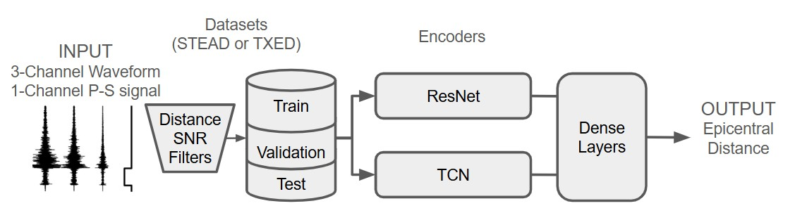
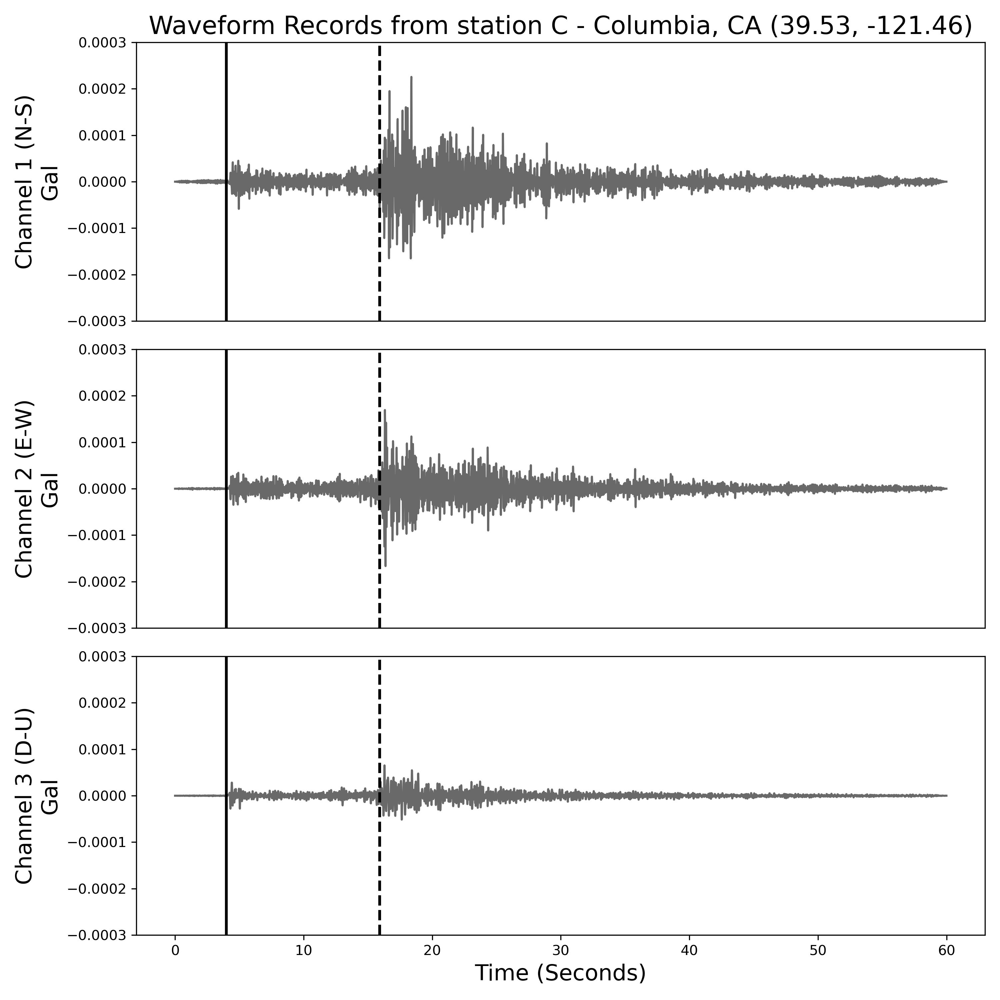

# Exploring Challenges in Deep Learning of Single-Station Ground Motion Records
**Earth Science Informatics 2025** | [Ümit Mert Çağlar](https://scholar.google.com/citations?user=1bUVmLsAAAAJ&hl=en)<a class="orcid-link" href="https://orcid.org/0000-0002-0391-3847" target="_blank" rel="noopener" title="ORCID: 0000-0002-0391-3847"></a>, Barış Yılmaz, Melek Türkmen, Erdem Akagündüz, Salih Tileylioğlu | METU & Kadir Has University, Turkey

[](https://github.com/caglarmert/mage)
[](https://api.wandb.ai/links/caglarmert/rdvjvsyu)
[](https://www.python.org/downloads/)

> **TL;DR:** Deep learning models for estimating an earthquake's epicentral distance from a single seismic station are usually fed auxiliary Primary/Secondary (P/S) wave arrival times alongside the raw waveform. We show these models lean almost entirely on that auxiliary signal rather than learning genuinely "deep" representations from the waveform itself: adding P/S phase information cuts L1 error by 2-4x across every architecture and dataset we tested, and the P/S time difference correlates with epicentral distance at Pearson r = 0.956.



---

## Key Contributions

* **A Controlled Ablation on Auxiliary Information:** A systematic study isolating the effect of P/S phase arrival times on single-station epicentral distance estimation, using identical model/data setups with and without this auxiliary channel.
* **Large-Scale Benchmark:** ResNet and TCN encoders evaluated via exhaustive hyperparameter search (144+ configurations: 2 datasets × 3 learning rates × 2 gamma values × 3 layer sizes × 2 architectures) on two large seismic datasets, STEAD and TXED.
* **Quantified Reliance on Shortcuts:** P/S phase information reduces L1 error by up to 4x, and correlates with epicentral distance at Pearson r = 0.956 / Spearman r = 0.926, exposing how strongly these models depend on the auxiliary signal rather than the waveform alone.
* **Full Reproducibility:** Public code repository and a complete Weights & Biases experiment history, including runtime, parameter importance, and all 144+ tracked runs.

---

## Datasets

| Dataset | Region | Stations | Records (filtered) |
|---|---|---|---|
| STEAD (global) | Worldwide | 743 | 147,195 |
| STEAD (local) | California, 300 km radius | subset of above | subset of above |
| TXED | Texas (TexNet) | 320 | ~90,000 |

Both datasets are filtered to events within 110 km of a station with SNR ≥ 25 dB, following the protocol of prior single-station studies. Each record contains 60 seconds of 3-channel (N-S, E-W, Up-Down) accelerometer data at 100 Hz, with labeled P- and S-wave arrival times.

<figure align="center">
  
  <figcaption><b>Figure:</b> A sample recorded event from STEAD, station at 39.53, -121.46 (Columbia, California). Primary (solid) and Secondary (dashed) wave arrival times are marked.</figcaption>
</figure>

---

## Results

We benchmark ResNet and Temporal Convolutional Network (TCN) encoders, with epicentral distance predicted via dense layers from either the 3-channel waveform alone ("No P/S") or the waveform plus a 4th channel encoding P/S arrival times ("P/S").

| Dataset | Model | L1 Error w/ P/S (km) | L1 Error w/o P/S (km) |
|---|---|---|---|
| STEAD Local | TCN | **1.74** | 7.00 |
| STEAD Local | ResNet | 4.47 | 13.33 |
| STEAD Global | TCN | **2.64** | 3.02 |
| STEAD Global | ResNet | 4.31 | 14.82 |
| TXED | TCN | **2.21** | 7.04 |
| TXED | ResNet | 3.56 | 6.92 |

**Key Takeaways:**
1. **Auxiliary Information Dominates:** Including P/S phase arrival times as an input channel reduces L1 error by 2-4x across every dataset and architecture tested, revealing a strong reliance on this shortcut rather than deep waveform features.
2. **TCN Outperforms ResNet:** TCN models consistently achieve lower error and lower variance across validation and test splits than ResNet, and are better suited to this task overall.
3. **Strong P/S-Distance Correlation:** Pearson (r = 0.956) and Spearman (r = 0.926) correlation coefficients between the P/S arrival time difference and epicentral distance confirm that this auxiliary signal is near-redundant with the prediction target itself.

## Implications

These results expose a critical gap in the current research landscape: robust methodologies for learning genuinely deep representations from single-station ground motion records, independent of auxiliary information such as phase picks or station-network topology, remain largely absent. The disparity in performance between global and localized subsets further suggests that future work should explore architectures and training strategies tailored to localized, dense seismic networks rather than relying on auxiliary timing shortcuts.

---

## Reproducibility

The reproducible experiments took 360 GPU-hours on a single NVIDIA A100 (80GB), for a total estimated power consumption of 108 kWh.

| Resource | Link |
| :--- | :--- |
| **Source Code** | [github.com/caglarmert/mage](https://github.com/caglarmert/mage) |
| **Experiment Tracking** | [W&B Report](https://api.wandb.ai/links/caglarmert/rdvjvsyu) |

This study was supported by the Scientific and Technological Research Council of Türkiye (TÜBİTAK) under Grant Number 121M732, and computations were performed at TÜBİTAK ULAKBIM, High Performance and Grid Computing Center (TRUBA).

---

## Citation

If you find this work useful in your research, please consider citing:

```bibtex
@article{caglar2025challenges,
  title={Exploring Challenges in Deep Learning of Single-Station Ground Motion Records},
  author={Caglar, Umit Mert and Yilmaz, Baris and Turkmen, Melek and Akagunduz, Erdem and Tileylioglu, Salih},
  journal={Earth Science Informatics},
  year={2025}
}
```
